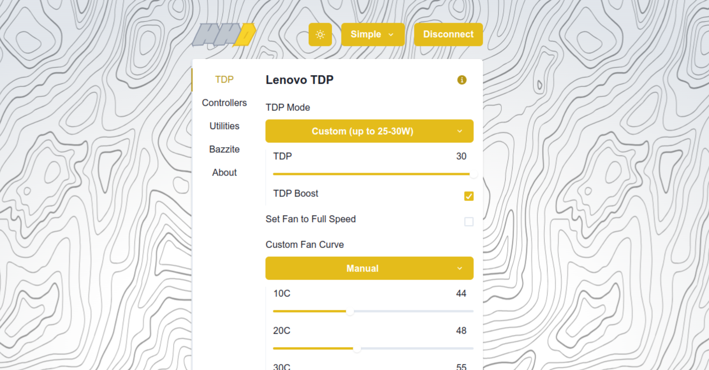
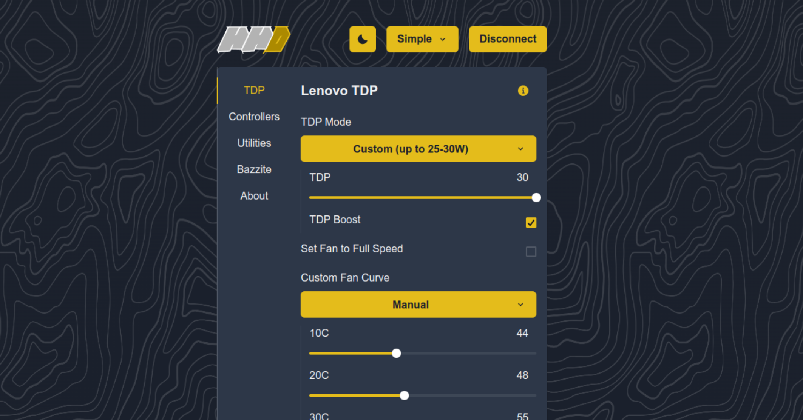

<h1 align="center">
    <picture>
        <source media="(prefers-color-scheme: dark)" srcset="https://raw.githubusercontent.com/hhd-dev/hhd/master/art/logo_dark.svg" width="50%">
        <source media="(prefers-color-scheme: light)" srcset="https://raw.githubusercontent.com/hhd-dev/hhd/master/art/logo_light.svg" width="50%">
        
    </picture>
</h1>

# Handheld Daemon UI

A UI app that can manage Handheld Daemon settings from Steam, the Desktop, and
the Web.




# Usage

There are two ways of accessing the app:

1. Go to https://hhd.dev to use the latest version via your browser.
2. Install the app locally to your device via a provided AppImage.
3. Use the version bundled with your distribution (coming soon)

# hhd.dev Website

Go to https://hhd.dev from your device and enter the token you can find under
`~/.config/hhd/token`.
You can now configure your device.
This app runs locally (no server) and it is hosted here on github pages
(https://hhd-dev.github.io/hhd-ui/).

No one can access your device from outside of it and not within it
without using the token.
The decky plugin uses the token as well, by reading it with your user priviledges.
Both of these precautions can be disabled, so you can configure your device
from outside of it by opening port 5335 and finding its ip (`ip addr`).

You can not use configure your device from outside of it
using https://hhd.dev due to a security policy called Mixed Content Serving.
Essentially, https websites can not access http APIs, with the exception being
http://localhost.
This will be fixed in the future by making the calls using TLS over Javascript.

For now, you can port forward port 5335 to your main computer over ssh if you
want to use it remotely with [hhd.dev](https://hhd.dev) or use the AppImage.

```bash
ssh <your-machine> -L 5335:localhost:5335
```

# Local Install

Download the latest AppImage release from the releases github page.

Make it executable via `chmod +x`, or in your file manager by enabling via:

```
Right-click > Properties > Permissions > Is Executable
```

Double click the AppImage file for the app to run.

Note, to have the app show up as a regular app, it's recommended to use an AppImage manager.

Examples of AppImage manager apps:

- Gear Lever - https://flathub.org/apps/it.mijorus.gearlever
- AppImageLauncher - https://github.com/TheAssassin/AppImageLauncher

# Dev Setup

Run the following commands:

```bash
# git clone repo

cd hhd-ui
npm ci
# To update requirements
# npm install

# run dev server, should be on localhost:5173
npm run dev
```

# License
The Handheld Daemon UI is licensed under THE GNU GPLv3+. See LICENSE for details.
Versions prior to and excluding 2.0.0 are licensed using MIT.