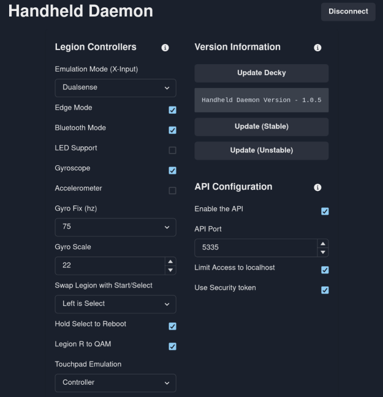

# Handheld Daemon UI

This prototype UI will be used to manage Handheld Daemon settings.
It is a static website, so installing will not be necessary soonTM.



# Usage

There are two ways of accessing the app:

1. go to https://hhd.dev to use the web app via your browser. This only works on your machine, it will not work from other devices.
2. alternatively, install the app locally to your device via AppImage

# Installation (AppImage)

Download the latest AppImage release from the releases github page.

Make it executable via `chmod +x`, or in your file manager by enabling via `right-click > properties > permissions > is executable`

Double click the AppImage file for the app to run.

Note, to have the app show up as a regular app, it's recommended to use an AppImage manager.

Examples of AppImage manager apps:

- Gear Lever - https://flathub.org/apps/it.mijorus.gearlever
- AppImageLauncher - https://github.com/TheAssassin/AppImageLauncher

# Dev Setup

Run the following commands:

```bash
# git clone repo

cd hhd-ui
npm ci
# To update requirements
# npm install

# run dev server, should be on localhost:5173
npm run dev
```
